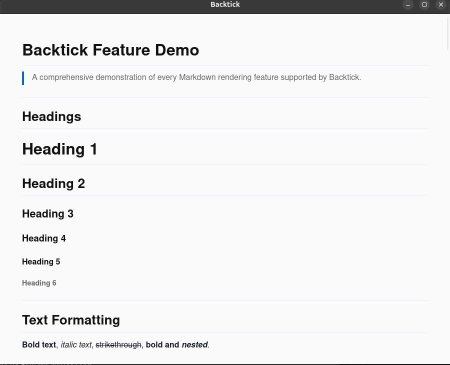

# Backtick

[](https://github.com/originalmmd/backtick/actions/workflows/ci.yml)
[](https://github.com/originalmmd/backtick/actions/workflows/release.yml)
[](LICENSE)
[](https://github.com/originalmmd/backtick/releases/latest)
[](https://github.com/originalmmd/backtick/releases)
[](https://tauri.app)

> A razor-sharp, zero-bloat Markdown document reader. You open a file, it renders it perfectly. That's it.

[Latest Release](https://github.com/originalmmd/backtick/releases/latest) · [Download Example](https://raw.githubusercontent.com/originalmmd/backtick/main/example.md) · [Website](https://originalmmd.github.io/backtick) · [Contributing](CONTRIBUTING.md)

---

## Screenshots



---

## Features

- **Instant Startup** — Launches in milliseconds. No splash screens, no waiting.
- **Under 10MB** — Built on Tauri with a Rust backend and native webview.
- **100% Offline & Private** — No telemetry, no analytics, no network requests.
- **Syntax Highlighting** — Beautiful code blocks via highlight.js with dozens of languages.
- **Mermaid Diagrams** — Render flowcharts, sequence diagrams, Gantt charts, and more.
- **Dark Mode** — System-aware with manual light/dark override.
- **File Association** — Double-click any `.md` file to open in Backtick.
- **Context Menu** — Right-click any file/folder for "Read with Backtick".
- **Drag & Drop** — Drag `.md` files onto the window to open them.
- **Open Dialog** — Ctrl+O (or Cmd+O) to browse and open files.
- **Single Instance** — Opening a file while Backtick is running opens it in the existing window.

---

## Installation

### Linux

#### Ubuntu / Debian (APT)

```bash
sudo add-apt-repository ppa:originalmmd/backtick-md
sudo apt update
sudo apt install backtick
```

#### Arch Linux (AUR)

```bash
paru -S backtick-bin
```

#### Flatpak

```bash
flatpak install flathub app.backtick.Reader
```

#### AppImage

Download `Backtick-*.AppImage` from the [latest release](https://github.com/originalmmd/backtick/releases/latest), then:

```bash
chmod +x Backtick-*.AppImage
./Backtick-*.AppImage
```

### macOS

#### Homebrew

```bash
brew install backtick
```

#### Manual

Download the `.dmg` from the [latest release](https://github.com/originalmmd/backtick/releases/latest), mount it, and drag Backtick to Applications.

### Windows

#### Installer

Download the `.msi` from the [latest release](https://github.com/originalmmd/backtick/releases/latest) and run it.

#### Winget

```bash
winget install backtick
```

---

## Building from Source

Prerequisites: [Rust](https://rustup.rs), [Node.js](https://nodejs.org), and system libraries (see [Tauri prerequisites](https://v2.tauri.app/start/prerequisites/)).

```bash
git clone https://github.com/originalmmd/backtick.git
cd backtick
npm install
npm run tauri dev      # Development mode
npm run tauri build    # Production build
```

---

## Contributing

See [CONTRIBUTING.md](CONTRIBUTING.md) for development workflow, code style, and pull request guidelines.

---

## License

Distributed under the MIT License. See `LICENSE` for more information.
