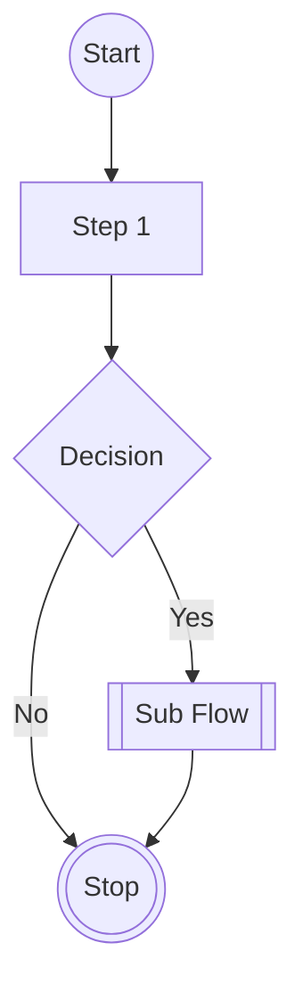

# User Flows

## [Flow Name]

```mermaid
flowchart TD
  Start((Start))
  Stop(((Stop)))
  Step1[Step 1]
  Decision{Decision}
  SubFlow@{shape: subproc, label: Sub Flow}

  Start --> Step1
  Step1 --> Decision
  Decision --"Yes"--> SubFlow
  Decision --"No"--> Stop
  SubFlow --> Stop
```

---

<!-- Repeat for each flow -->
