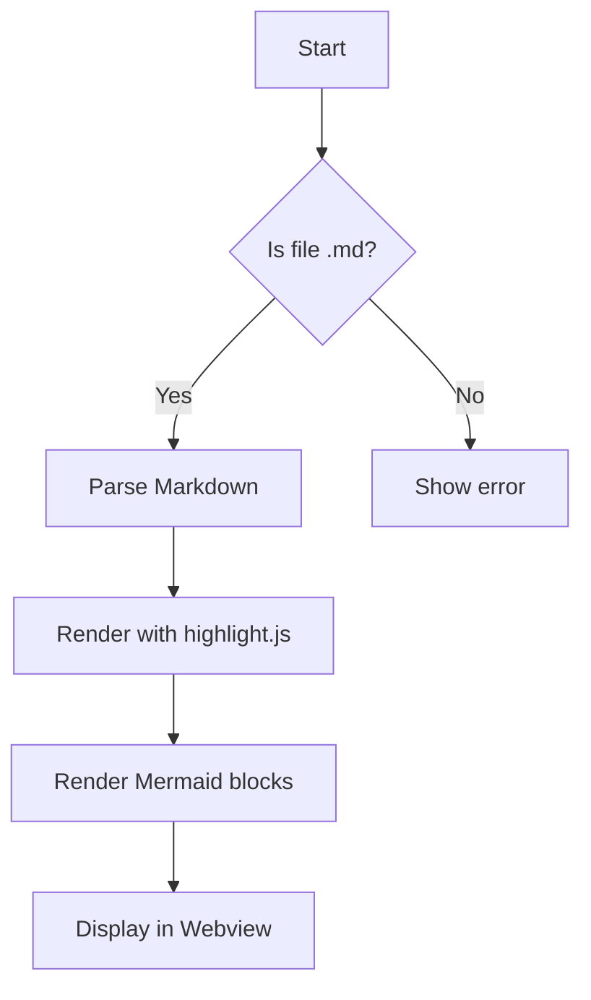
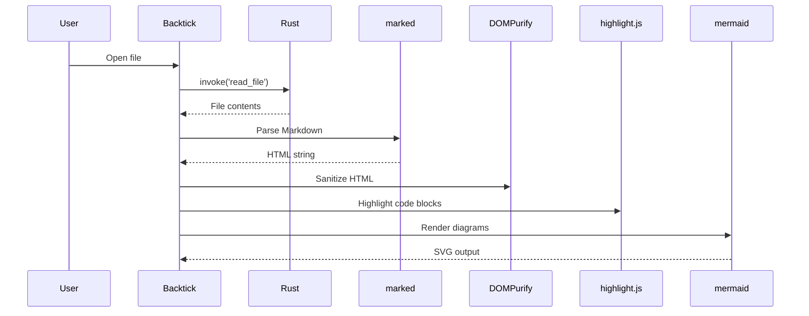
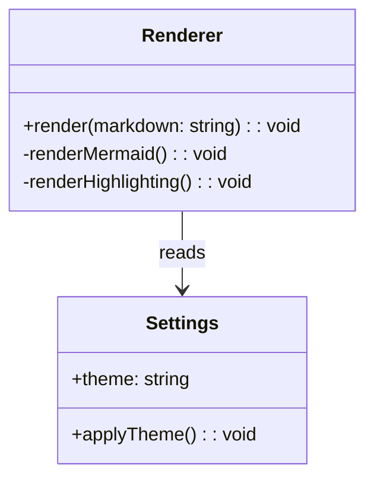

# Backtick Feature Demo

> A comprehensive demonstration of every Markdown rendering feature supported by Backtick.

---

## Headings

# Heading 1
## Heading 2
### Heading 3
#### Heading 4
##### Heading 5
###### Heading 6

---

## Text Formatting

**Bold text**, *italic text*, ~~strikethrough~~, **bold and _nested_**.

---

## Links

[Backtick GitHub Repository](https://github.com/originalmmd/backtick)

---

## Lists

### Unordered

- Item one
- Item two
- Item three
  - Nested item A
  - Nested item B
    - Deeply nested

### Ordered

1. First step
2. Second step
3. Third step

### Task List

- [x] Implement Markdown rendering
- [x] Add syntax highlighting
- [x] Support Mermaid diagrams
- [ ] Future feature

---

## Blockquotes

> Simple blockquote.

> Multi-paragraph blockquote.
>
> Second paragraph.

> Nested blockquote
>
> > Inside another

---

## Tables

| Feature | Status | Priority |
| :--- | :---: | ---: |
| Headings | Complete | High |
| Syntax Highlighting | Complete | High |
| Mermaid Diagrams | Complete | Medium |
| Dark Mode | Complete | High |

---

## Code Blocks

### JavaScript

```javascript
function fibonacci(n) {
  if (n <= 1) return n;
  return fibonacci(n - 1) + fibonacci(n - 2);
}

const result = fibonacci(10);
console.log(`Fibonacci(10) = ${result}`);
```

### Rust

```rust
#[derive(Debug)]
struct Document {
    title: String,
    content: String,
    line_count: usize,
}

fn main() {
    let doc = Document {
        title: String::from("Hello"),
        content: String::from("World"),
        line_count: 42,
    };
    println!("{:?}", doc);
}
```

### Python

```python
from dataclasses import dataclass

@dataclass
class Point:
    x: float
    y: float

    def distance_to(self, other: "Point") -> float:
        return ((self.x - other.x) ** 2 + (self.y - other.y) ** 2) ** 0.5

p1 = Point(0, 0)
p2 = Point(3, 4)
print(p1.distance_to(p2))  # 5.0
```

### Diff

```diff
- console.log("old code");
+ console.log("new code");
```

### Inline Code

Use the `render()` function to parse Markdown, and `DOMPurify.sanitize()` for security.

---

## Mermaid Diagrams

### Flowchart



### Sequence Diagram



### Class Diagram



---

## Horizontal Rule

A horizontal rule appears above and below this paragraph.

---

---

## Images


---

## Everything Combined

> **Tip:** You can run Backtick from the command line:
>
> ```bash
> backtick path/to/document.md
> ```
>
> Or use `Ctrl+O` / `Cmd+O` to open a file from within the app.

| Shortcut | Action |
| :--- | :--- |
| `Ctrl+O` | Open file dialog |
| Drag & drop | Drop `.md` file anywhere in the window |
| CLI arg | `backtick file.md` |

This file exercises every rendering feature Backtick supports. If it all looks correct, your installation is working perfectly.
